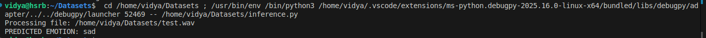
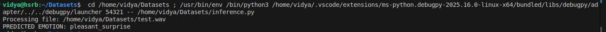
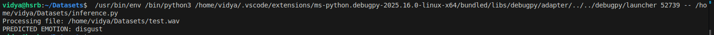
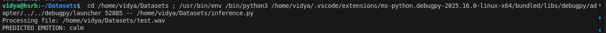

# Demonstrations

This page showcases example interactions with the **HSR Multimodal Interaction Stack**, including speech recognition, emotion inference, dialogue responses, and robot behaviors.

---

## 1. Full Multimodal Interaction Demo

A complete demonstration of the system, including:
- Whisper ASR speech recognition  
- VAD-based segmentation  
- CRNN emotion detection  
- GPT dialogue generation  
- ROS 2 gesture execution  

- [▶️ Full Multimodal Interaction Demo](/hsr_multimodal_interaction_stack/media/demos/full_demo.mp4)

---

## 2. Example Conversations (Text-Only Samples)

### Calm Interaction
**User:** _“Hello, how are you today?”_  
**HSR:** _“I’m here and happy to talk with you. How can I help today?”_

### Stress Detection & Wellness Trigger
**User (stressed tone):** _“I feel overwhelmed… I don’t know what to do.”_  
**HSR:**  
- _“I hear that you’re feeling overwhelmed. Let's try a short calming exercise.”_  
- *Robot performs gentle head nod and begins wellness mode.*

### Story Mode Trigger
**User:** _“Can you tell me a story?”_  
**HSR:** _“Of course. Let me share a short uplifting story…”_  
*(story continues)*

---

## 3. Emotion Detection Examples

Below are screenshots from the CRNN-based vocal emotion classifier, showing how the system interprets different tones from test audio.

### **Sad**

---

### **Pleasant Surprise**

---

### **Disgust**

---

### **Calm**

---

## 4. Robot Behavior Demos

These will show gestures or routines the robot performs:

- ### Greeting
- [🤖 Greeting Gesture Demo](/hsr_multimodal_interaction_stack/media/demos/greeting.mp4)

- ### Head Nod
- [🙂 Head Nod Demo](/hsr_multimodal_interaction_stack/media/demos/head_nod.mp4)

- ### Head Shake
- [🙃 Head Shake Demo](/hsr_multimodal_interaction_stack/media/demos/head_shake.mp4)

- ### Goodbye
- [👋 Goodbye Gesture Demo](/hsr_multimodal_interaction_stack/media/demos/goodbye.mp4)
---
